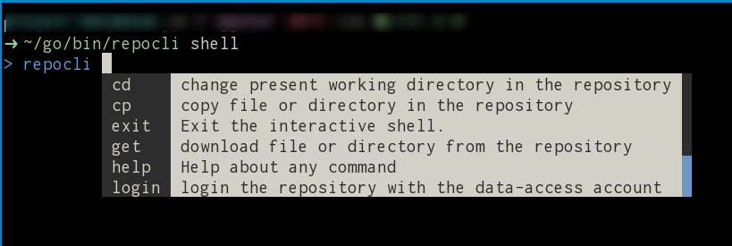

# repocli: cross-platform CLI for managing the Donders Repository data

A command-line tool for performing basic operations on the data content (not the metadata) of the Donders Repository collections.  In essense, it uses the WebDAV protocol to implemente the operations; therefore it is also a genetic tool for managing data accessible via WebDAV with the HTTP basic authentication.

The following operations are currently implemented:

- ls: list a directory
- mkdir: create a new directory
- cp: copy a file or a directory
- mv: rename a file or a directory
- rm: remove a file or a directory
- get: download a file or a directory
- put: upload a file or a directory

When performing recursive operation on a directory, the tool does a directory walk-through and applies the operation on individual files in parallel.  This approach breaks down a lengthy bulk-operation request into multiple shorter, less resource demanding requests.  It helps improve the overall success rate of the operation.

## Usage

```
A CLI for managing data content of the Donders Repository collections.

Usage:
  repocli [command]

Available Commands:
  completion  generate the autocompletion script for the specified shell
  cp          copy file or directory in the repository
  get         download file or directory from the repository
  help        Help about any command
  ls          list file or directory in the repository
  mkdir       create new directory in the repository
  mv          move file or directory in the repository
  put         upload file or directory to the repository
  rm          remove file or directory from the repository
  shell       start an interactive shell

Flags:
  -c, --config path       path of the configuration YAML file. (default "/home/honlee/.repocli.yml")
  -h, --help              help for repocli
  -n, --nthreads number   number of concurrent worker threads. (default 4)
  -s, --silent            set to slient mode (i.e. do not show progress)
  -u, --url URL           URL of the webdav server.
  -v, --verbose           verbose output

Use "repocli [command] --help" for more information about a command.

A CLI for managing data content of the Donders Repository collections.
```

The username/password of the data-access account should be provided in the configuration file (i.e. the `-c` flag) in YAML format.  The default location of this configuration file is `${HOME}/.repocli.yml` on Linux/MacOSX and `C:\Users\<username>\.repocli.yml` on Windows. Hereafter is an example:

```yaml
repository:
  username: "username"
  password: "password"
```

When using the single-command mode (i.e. not the shell mode, see below), the base URL of the repository should also be provided via the `-u` option.  It can also be provided via the `baseurl` key in the configuration file, e.g.

```yaml
repository:
  baseurl: "https://webdav.data.donders.ru.nl"
  username: "username"
  password: "password"
```

If the `-u` option and the `baseurl` key are both specified, the value provided by the `-u` option takes precedence.

__⚠️ The configuration is in plain text and thus you should make the configuration file only accessible to yourself. ⚠️__ On Linux and MacOSX, one can run the following command in a terminal:

```bash
$ chmod 600 $HOME/.repocli.yml
```

__The shell mode__

In addition to run the operations as individual commands (single-command mode), the CLI can also be used in an interactive shell.  One uses the `shell` command to enter the shell mode:

```bash
$ repocli shell
```

The CLI's specific prompt `> repocli` will be displayed as the screenshot below, waiting for furhter commands from the user.



In the shell mode, the following additional operations are enabled:

- login: login the repository
- cd: change the present working directory in the repository
- pwd: show the present working directory in the repository
- lcd: change the present working directory at local
- lpwd: show the present working directory at local
- lls: list content in the present working directory at local

The `login` operation can be used to configure a new connection if you choose to save the credential.  For instance, you can start the shell mode using the `-c` option to point to a non-existing file:

```bash
$ repocli shell -c myrepo.yml
```

Then follow the prompt to provide the necessary information for connection and choose `y` to save the credential.  Once the login is done successfully, the file `myrepo.xml` will be created with the connection information. You can then reuse the configuration file in the future.

### listing a directory

Given a collection with identifier `di.dccn.DAC_3010000.01_173`, the WebDAV directory in which the collection data is stored is `/dccn/DAC_3010000.01_173`.  To list the content of this WebDAV directory, one does

```bash
$ repocli ls -l /dccn/DAC_3010000.01_173
/dccn/DAC_3010000.01_173:
 drwxrwxr-x            0 /dccn/DAC_3010000.01_173/Cropped
 drwxrwxr-x            0 /dccn/DAC_3010000.01_173/raw
 drwxrwxr-x            0 /dccn/DAC_3010000.01_173/test1
 drwxrwxr-x            0 /dccn/DAC_3010000.01_173/test2021
 drwxrwxr-x            0 /dccn/DAC_3010000.01_173/test3
 drwxrwxr-x            0 /dccn/DAC_3010000.01_173/test_loc.new
 drwxrwxr-x            0 /dccn/DAC_3010000.01_173/test_sync
 drwxrwxr-x            0 /dccn/DAC_3010000.01_173/testx
 drwxrwxr-x            0 /dccn/DAC_3010000.01_173/xyz.5
 drwxrwxr-x            0 /dccn/DAC_3010000.01_173/xyz.x
 -rw-rw-r--          203 /dccn/DAC_3010000.01_173/MANIFEST.txt.1
 -rw-rw-r--       191503 /dccn/DAC_3010000.01_173/MD5E-s191503--8661ce04ccbbf51e96ce124e30fc0c8c.txt
 -rw-rw-r--     49152352 /dccn/DAC_3010000.01_173/MP2RAGE.nii
 -rw-rw-r--         2589 /dccn/DAC_3010000.01_173/Makefile
...
```

### removing a file or directory

Assuming that we want to remove the file `MANIFEST.txt.1` from the collection content listed above, we do

```bash
$ repocli rm /dccn/DAC_3010000.01_173/MANIFEST.txt.1
```

If we want to remove the entire sub-directory `testx`, we use the command

```bash
$ repocli rm -r /dccn/DAC_3010000.01_173/textx
```

where the extra flag `-r` indicates recursive removal.

### creating a directory

To create a subdirectory `demo` in the collection, we do

```bash
$ repocli mkdir /dccn/DAC_3010000.01_173/demo
```

One could also create a directory tree use the same command, any missing parent directories will also be created (similar to the `mkdir -p` command on Linux).  For example, if we want to create a directory tree `demo1/data/sub-001/ses-mri01`, we do

```bash
$ repocli mkdir /dccn/DAC_3010000.01_173/demo1/data/sub-001/ses-mri01
```

It can be done with or without the existence of the parent tree structure `demo1/data/sub-001`.

### uploading/download a single file

For uploading/downloading a single file to/from the collection in the repository.  One use the `put` and `get` sub-commands, respectively.  The `put` and `get` sub-commands require two arguments.  The first argument refers to the _source_ path; while the second to the _destination_ path.

The WebDAV path should always be in form of the absolute path (i.e. started with `/`); while the local path can be in a format recognized by the shell.

For example, to upload a local file `test.txt` in the present working directory to `/dccn/DAC_3010000.01_173/demo/test.txt`, one does

```bash
$ repocli put ./test.txt /dccn/DAC_3010000.01_173/demo/test.txt
```

To download a remote file `/dccn/DAC_3010000.01_173/demo/test.txt` to `test.txt.new` in the home directory at local (refered by the `$HOME` variable), one does

```bash
$ repocli get /dccn/DAC_3010000.01_173/demo/test.txt $HOME/test.txt.new
```

If the destination is a directory, file will be downloaded/uploaded into the directory with the same name.  If the destination is an existing file, the file will be overwritten by the content of the source.

### resursive uploading/downloading a directory

Assuming that we have a local directory `/project/3010000.01/demo`, and we want to upload the content of it recursively to the collection under the sub-directory `demo`.  We use the command below:

```bash
$ repocli put /project/3010000.01/demo/ /dccn/DAC_3010000.01_173/demo
```

where the first argument to `put` is a directory locally as the _source_, and the second is a directory in the repository as the _destination_.

For downloading a directory from the repository, one does

```bash
$ repocli get /dccn/DAC_3010000.01_173/demo/ /project/3010000.01/demo.new
```

where the first argument is a directory in the repository as the source, and the second is a local directory as the destination.

__Note:__ The same as the `rsync` command, the tailing `/` in the _source_ instructs the tool to _copy the content_ into the destination.  If the tailing `/` is left out, it will _copy the directory by name_ in to the destination, resulting in the content being put into a (new) sub-directory in the destination.

### moving (i.e. renaming) a file or a directory

For renaming a file within a collection, one uses the `mv` sub-command.  This sub-command also takes two arguments, the _source_ and the _destniation_.

For example, if we want to rename a file `/dccn/DAC_3010000.01_173/test.txt` to `/dccn/DAC_3010000.01_173/test.txt.old` in the repository, we do

```bash
$ repocli mv /dccn/DAC_3010000.01_173/test.txt /dccn/DAC_3010000.01_173/test.txt.old
```

We could also rename an entire directory.  For example, if we want to rename a `/dccn/DAC_3010000.01_173/demo` to `/dccn/DAC_3010000.01_173/demo.new`, we use the command below (__note the tailing `/` of the _source_ for "moving the content over"__):

```bash
$ repocli mv /dccn/DAC_3010000.01_173/demo/ /dccn/DAC_3010000.01_173/demo.new
```

Moving the _source_ directory into a the _destination_ directory can be achived by leaving the tailing `/` out the _source_ directory.  Taking the example above, if the tailing `/` is omitted, e.g.

```bash
$ repocli mv /dccn/DAC_3010000.01_173/demo /dccn/DAC_3010000.01_173/demo.new
```

the end result will a new directory `/dccn/DAC_3010000.01_173/demo.new/demo` in which the data within the _source_ directory are moved over.

